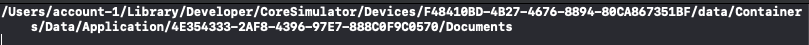
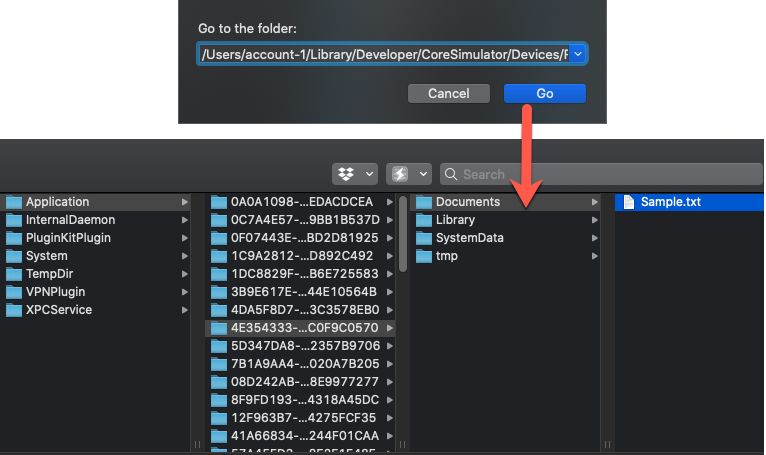

# FileManager Extensions

This set of FileManager extensions will allow you to save and read text files that are stored in the application's DocumentsDirectory.

Simply create a file called **FileManager+Extensions.swift** and paste the following code in to the file.

From then on, you can create an instance of FileManager followed by the "." and you will see these methods presented to you as code completion.


A set of extensions for FileManager to deal with saving and reading documents from the documents directory.

```swift
extension FileManager {
    func docDirPath() -> String {
        let docDir = urls(for: .documentDirectory, in: .userDomainMask).first!
        return docDir.path
    }
    
    func saveDocument(contents:String, docName:String, completion: ((Error?) -> Void)? = nil) {
        let url = urls(for: .documentDirectory, in: .userDomainMask).first!.appendingPathComponent(docName)
        do {
            try contents.write(to: url, atomically: true, encoding:.utf8)
        } catch {
            print("Could not save file to directory: \(error.localizedDescription)")
            completion!(error)
        }
    }
    
    func readDocument(docName: String, completion: (String?, Error?) -> Void) {
        let url = urls(for: .documentDirectory, in: .userDomainMask).first!.appendingPathComponent(docName)
        do {
            completion(try String(contentsOf: url), nil)
        } catch {
            completion(nil, error)
            print(error.localizedDescription)
        }
    }
}
```

### How to Use

#### Getting the Path to the Documents Directory

Add the following line to the **application:didFinishLaunchingWithOptions:** method of the **AppDelegate**

```swift
print(FileManager().docDirPath())
```

This will display the path to the simulator's Document directory in the console



You can then select the text and do command - shift - G in the finder and paste in the path to go to reveal the directory.



#### Saving Text to a file in the Documents Directory

###### Option 1

If you feel comfortable that you will have no errors then you can simply do something like this:

```Swift
let someText = "This is some text for the body content of the file I want to save"
let fileName = "MyFile.txt"
// This will save the contents of someText to a file named "MyFile.txt"
FileManager().saveDocument(contents: someText, docName: fileName)
```

###### Option 2

If you want to check for errors, you can use an optional closure that checks for errors and reports

```swift
let someText = "This is some text for the body content of the file I want to save"
let fileName = "MyFile.txt"
// Use the closure to report back to the user that there is an error
FileManager().saveDocument(contents: "Some new text",
                           docName: "Another Doc.txt") { (error) in
   if let error = error {
     // You got an error so deal with it and let the user know
         print(error.localizedDescription)
    }
}
```

#### Reading Text from a file in the Documents Directory

To read a file from the documents directory you can do the following

```swift
let fileName = "MyFile.txt"
FileManager().readDocument(docName: "Sample.txt") { (data, error) in
    if let error = error {
      // You got an error so deal with it and let your user know
                        print(error.localizedDescription)
      }
    if let data = data {
      // You got some data (String) back so you can now do with it as you please
         print(data)
    }
}
```

